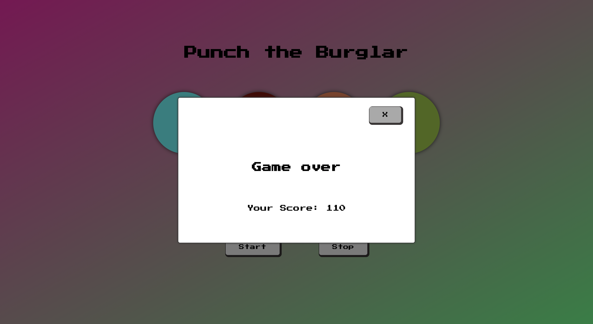

# Speed Game App: Punch the Burglar

## Description:

 An application developed with React.js for the Full Stack Web Development program in Business College Helsinki.

 Punch the Burglar is a speed game where you have to quickly click the changing image of a burglar in 4  different button objects.

 The game speeds up all the time and you have to keep up with the speed. I you fail to do so the game will end.

 ## Application screenshots:

 
 
 

